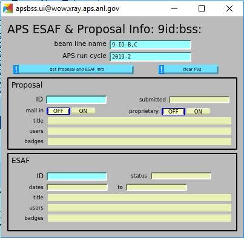
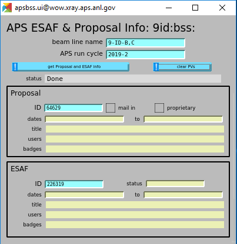
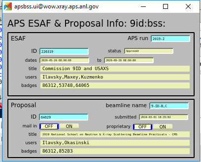

.. index:: apsbss

.. _apsbss_application:

apsbss
------

Provide information from APS Proposal and ESAF (experiment safety approval
form) databases as PVs at each beam line so that this information
(metadata) may be added to new data files.  The ``aps-dm-api``
(``dm`` for short) package [#]_
is used to access the APS databases as read-only.

*No information is written back to the APS
databases from this software.*

.. [#] ``dm``: https://anaconda.org/search?q=aps-dm-api

.. sidebar:: PVs for experiment metadata

	This information retreived from the APS databases is stored in PVs
	on the beam line subnet.  These PVs are available to *any* EPICS
	client as metadata (SPEC, area detector, Bluesky, GUI screens, logging, other).
	This design allows the local instrument team to override
	any values read from the APS databases, if that is needed.

Given:

* a beam line name (such as ``9-ID-B,C``)
* APS run cycle name (such as ``2019-2``) to locate a specific proposal ID
* proposal ID number (such as ``66083``)
* ESAF ID number (such as ``226319``)

The typical information obtained includes:

* ESAF & proposal titles
* user names
* user institutional affiliations
* user emails
* applicable dates, reported in ISO8601 time format
* is proposal propietary?
* is experiment mail-in?

These PVs are loaded on demand by the local instrument team at the beam line.
See the :ref:`apsbss_startup` section for details about
managing the EPICS PVs.

Overview
++++++++

We'll demonstrate ``apsbss`` with information for APS beam
line 9-ID, using PV prefix ``9id:bss:``.

#. Create the PVs in an EPICS IOC
#. Initialize PVs with beam line name and APS run cycle number
#. Set PVs with the Proposal and ESAF ID numbers
#. Retrieve (& update PVs) information from APS databases

**Enter beam line and APS run (cycle) info**

   Image of ``apsbss.ui`` screen GUI in caQtDM showing PV prefix
   (``9id:bss:``), APS run cycle ``2019-2`` and beam line ``9-ID-B,C``.

   * beam line name PV: ``9id:bss:proposal:beamline``
   * APS run cycle PV: ``9id:bss:esaf:cycle``

**Enter Proposal and ESAF ID numbers**

Note we had to use the APS run cycle of `2019-2`
to match what is in the proposal's information.

   Image of ``apsbss.ui`` screen GUI in caQtDM with Proposal
   and ESAF ID numbers added.

   * proposal ID number PV: ``9id:bss:proposal:id``
   * ESAF ID number PV: ``9id:bss:esaf:id``

**Update PVs from APS databases**

In the GUI, press the button labeled ``get Proposal and ESAF info``.
This button executes the command line: ``apsbss update 9id:bss:``

Here's a view of the GUI after running the update.  The
information shown in the GUI is only part of the PVs,
presented in a compact format. A full report of the
information received, including PV names, is available for
:download:`download <../resources/apsbss_report.txt>`.

   Image of ``apsbss.ui`` screen GUI in caQtDM showing Proposal
   and ESAF information.

To clear the PVs, in the GUI, press the button labeled ``clear PVs``.
This button executes the command line: ``apsbss clear 9id:bss:``

Initialize PVs for beam line and APC run cycle
++++++++++++++++++++++++++++++++++++++++++++++

After creating the PVs in an IOC, the next step is to
initialize them with the beam line name and the APS
run cycle name.  Both of these must match exactly
with values known in the data management (``dm``) system.

For any of these commands, you must know the EPICS
PV prefix to be used.  The examples above are for
beam line 9-ID.  The PV prefix in these examples
is ``9id:bss:``.

What beam line name to use?
^^^^^^^^^^^^^^^^^^^^^^^^^^^

To learn the beam line names accepted by the system, use this command
(showing names defined on 2020-07-10)::

    $ apsbss beamlines
    1-BM-B,C       8-ID-I         15-ID-B,C,D    23-BM-B
    1-ID-B,C,E     9-BM-B,C       16-BM-B        23-ID-B
    2-BM-A,B       9-ID-B,C       16-BM-D        23-ID-D
    2-ID-D         10-BM-A,B      16-ID-B        24-ID-C
    2-ID-E         10-ID-B        16-ID-D        24-ID-E
    3-ID-B,C,D     11-BM-B        17-BM-B        26-ID-C
    4-ID-C         11-ID-B        17-ID-B        27-ID-B
    4-ID-D         11-ID-C        18-ID-D        29-ID-C,D
    5-BM-C         11-ID-D        19-BM-D        30-ID-B,C
    5-BM-D         12-BM-B        19-ID-D        31-ID-D
    5-ID-B,C,D     12-ID-B        20-BM-B        32-ID-B,C
    6-BM-A,B       12-ID-C,D      20-ID-B,C      33-BM-C
    6-ID-B,C       13-BM-C        21-ID-D        33-ID-D,E
    6-ID-D         13-BM-D        21-ID-E        34-ID-C
    7-BM-B         13-ID-C,D      21-ID-F        34-ID-E
    7-ID-B,C,D     13-ID-E        21-ID-G        35-ID-B,C,D,E
    8-BM-B         14-BM-C        22-BM-D
    8-ID-E         14-ID-B        22-ID-D

For either station at 9-ID, use ``9-ID-B,C``.

What APS run cycle to use?
^^^^^^^^^^^^^^^^^^^^^^^^^^

To learn the APS run cycle names accepted by the system, use this command
(showing APS run cycle names defined on 2020-07-10)::

    $ apsbss cycles
    2008-3    2011-2    2014-1    2016-3    2019-2
    2009-1    2011-3    2014-2    2017-1    2019-3
    2009-2    2012-1    2014-3    2017-2    2020-1
    2009-3    2012-2    2015-1    2017-3    2020-2
    2010-1    2012-3    2015-2    2018-1
    2010-2    2013-1    2015-3    2018-2
    2010-3    2013-2    2016-1    2018-3
    2011-1    2013-3    2016-2    2019-1

Pick the cycle of interest.  Here, we pick ``2020-2``.

To print the full report (including start and end of each cycle)::

    $ apsbss cycles --full
    ====== =================== ===================
    cycle  start               end                
    ====== =================== ===================
    2020-2 2020-06-09 07:00:00 2020-10-01 07:00:00
    2020-1 2020-01-28 08:00:00 2020-06-09 07:00:00
    2019-3 2019-09-24 07:00:00 2020-01-28 08:00:00
    2019-2 2019-05-21 07:00:00 2019-09-24 07:00:00
    2019-1 2019-01-22 08:00:00 2019-05-21 07:00:00
    2018-3 2018-09-25 07:00:00 2019-01-22 08:00:00
    2018-2 2018-05-22 07:00:00 2018-09-25 07:00:00
    2018-1 2018-01-23 08:00:00 2018-05-22 07:00:00
    2017-3 2017-09-26 07:00:00 2018-01-23 08:00:00
    2017-2 2017-05-23 07:00:00 2017-09-26 07:00:00
    2017-1 2017-01-24 08:00:00 2017-05-23 07:00:00
    2016-3 2016-09-27 07:00:00 2017-01-24 08:00:00
    2016-2 2016-05-24 07:00:00 2016-09-27 07:00:00
    2016-1 2016-01-26 08:00:00 2016-05-24 07:00:00
    2015-3 2015-09-29 07:00:00 2016-01-26 08:00:00
    2015-2 2015-05-26 07:00:00 2015-09-29 07:00:00
    2015-1 2015-01-27 08:00:00 2015-05-26 07:00:00
    2014-3 2014-09-25 07:00:00 2015-01-27 08:00:00
    2014-2 2014-05-20 07:00:00 2014-09-25 07:00:00
    2014-1 2014-01-21 08:00:00 2014-05-20 07:00:00
    2013-3 2013-09-24 07:00:00 2014-01-21 08:00:00
    2013-2 2013-05-22 07:00:00 2013-09-24 07:00:00
    2013-1 2013-01-22 08:00:00 2013-05-22 07:00:00
    2012-3 2012-09-25 07:00:00 2013-01-22 08:00:00
    2012-2 2012-05-23 07:00:00 2012-09-25 07:00:00
    2012-1 2012-01-24 08:00:00 2012-05-23 07:00:00
    2011-3 2011-09-27 07:00:00 2012-01-24 08:00:00
    2011-2 2011-05-25 07:00:00 2011-09-27 07:00:00
    2011-1 2011-01-25 08:00:00 2011-05-25 07:00:00
    2010-3 2010-09-27 23:00:00 2011-01-25 08:00:00
    2010-2 2010-05-26 07:00:00 2010-09-28 07:00:00
    2010-1 2010-01-26 08:00:00 2010-05-26 07:00:00
    2009-3 2009-09-29 07:00:00 2010-01-26 08:00:00
    2009-2 2009-05-20 07:00:00 2009-09-29 07:00:00
    2009-1 2009-01-21 08:00:00 2009-05-20 07:00:00
    2008-3 2008-09-24 07:00:00 2009-01-21 08:00:00
    ====== =================== ===================

Write the beam line name and cycle to the PVs
^^^^^^^^^^^^^^^^^^^^^^^^^^^^^^^^^^^^^^^^^^^^^

To configure ``9id:bss:`` PVs for beam line
``9-ID-B,C`` and cycle ``2020-2``,
use this command::

    $ apsbss setup 9id:bss: 9-ID-B,C 2020-2
    connected in 0.143s
    setup EPICS 9id:bss: 9-ID-B,C cycle=2020-2 sector=9

Or you could enter them into the appropriate boxes on the GUI.

What Proposal and ESAF ID numbers to use?
+++++++++++++++++++++++++++++++++++++++++

Proposals are usually valid for two years.  To learn what
proposals are valid for your beam line, use this command
with your own beam line's name.  The report will provide
two tables, one for ESAFs for the current cycle and the
other for proposals
within the last two years (6 APS cycles)::

    $ apsbss current 9id:bss: 9-ID-B,C
    Current Proposal(s) on 9-ID-B,C

    ===== ====== =================== ==================== ========================================
    id    cycle  date                user(s)              title
    ===== ====== =================== ==================== ========================================
    57504 2019-3 2017-10-27 15:31:46 Zhang,Levine,Long... Towards USAXS/SAXS/WAXS Characterizat...
    55236 2019-2 2017-07-07 12:32:39 Du,Vacek,Syed,Hon... Developing 3D cryo ptychography at th...
    64629 2019-2 2019-03-01 18:35:02 Ilavsky,Okasinski    2019 National School on Neutron & X-r...
    62490 2019-1 2018-10-25 11:10:49 Ilavsky,Frith,Sun    Dissolution of nano-precipitates in m...
    ===== ====== =================== ==================== ========================================

    Current ESAF(s) on sector 9

    ====== ======== ========== ========== ==================== ========================================
    id     status   start      end        user(s)              title
    ====== ======== ========== ========== ==================== ========================================
    221805 Approved 2020-02-18 2020-12-25 Chen,Deng,Yao,Jia... Bionanoprobe commissioning
    226319 Approved 2020-05-26 2020-09-28 Ilavsky,Maxey,Kuz... Commission 9ID and USAXS
    226572 Approved 2020-06-10 2020-09-28 Sterbinsky,Heald,... 9BM Beamline Commissioning 2020-2
    226612 Approved 2020-06-10 2020-09-28 Chen,Deng,Yao,Jia... Bionanoprobe commissioning
    ====== ======== ========== ========== ==================== ========================================

Note that some of the information in the tables above has been removed for brevity.

View Proposal Information
+++++++++++++++++++++++++

To view information about a specific proposal, you
must be able to provide the proposal's ID number and
the APS run cycle name.

::

    $ apsbss proposal 64629 2019-2 9-ID-B,C
    duration: 36000
    endTime: '2019-06-25 17:00:00'
    experimenters:
    - badge: 'text_number_here'
      email: uuuuuuuuuu@email.fqdn
      firstName: Jan
      id: number_here
      instId: 3927
      institution: Argonne National Laboratory
      lastName: Ilavsky
    - badge: 'text_number_here'
      email: uuuuuuuuuu@email.fqdn
      firstName: John
      id: number_here
      instId: 3927
      institution: Argonne National Laboratory
      lastName: Okasinski
      piFlag: Y
    id: 64629
    mailInFlag: N
    proprietaryFlag: N
    startTime: '2019-06-25 07:00:00'
    submittedDate: '2019-03-01 18:35:02'
    title: 2019 National School on Neutron & X-ray Scattering Beamline Practicals - CMS
    totalShiftsRequested: 12

Get ESAF Information
++++++++++++++++++++

To view information about a specific ESAF, you
must be able to provide the ESAF ID number.

::

    $ apsbss esaf 226319
    description: We will commission beamline and  USAXS instrument. We will perform experiments
      with safe beamline standards and test samples (all located at beamline and used
      for this purpose routinely) to evaluate performance of beamline and instrument.
      We will perform hardware and software development as needed.
    esafId: 226319
    esafStatus: Approved
    esafTitle: Commission 9ID and USAXS
    experimentEndDate: '2020-09-28 08:00:00'
    experimentStartDate: '2020-05-26 08:00:00'
    experimentUsers:
    - badge: 'text_number_here'
      badgeNumber: 'text_number_here'
      email: uuuuuuuuuu@email.fqdn
      firstName: Jan
      lastName: Ilavsky
    - badge: 'text_number_here'
      badgeNumber: 'text_number_here'
      email: uuuuuuuuuu@email.fqdn
      firstName: Evan
      lastName: Maxey
    - badge: 'text_number_here'
      badgeNumber: 'text_number_here'
      email: uuuuuuuuuu@email.fqdn
      firstName: Ivan
      lastName: Kuzmenko
    sector: 09

Update EPICS PVs with Proposal and ESAF
+++++++++++++++++++++++++++++++++++++++

To update the PVs with Proposal and Information from the APS
database, first enter the proposal and ESAF ID numbers into
the GUI (or set the ``9id:bss:proposal:id``, and respectively).
Note that for this ESAF ID, we had to change the cycle to `2019-2`.

Then, use this command to retrieve the information and update
the PVs::

    $ apsbss update 9id:bss:
    update EPICS 9id:bss:
    connected in 0.105s

Clear the EPICS PVs
+++++++++++++++++++

To clear the information from the PVs, use this command::

    $ apsbss clear 9id:bss:
    clear EPICS 9id:bss:
    connected in 0.104s
    cleared in 0.011s

Report information in the EPICS PVs
+++++++++++++++++++++++++++++++++++

To view all the information in the PVs, use this command::

    $ apsbss report 9id:bss:
    clear EPICS 9id:bss:

Since this content is rather large, it is available
for download: :download:`apsbss report <../resources/apsbss_report.txt>`

Example - ``apsbss`` command line
+++++++++++++++++++++++++++++++++

Before using the command-line interface, find out what
the *apsbss* application expects::

	$ apsbss  -h
	usage: apsbss.py [-h]
					{beamlines,current,cycles,esaf,proposal,clear,setup,update}
					...

	Retrieve specific records from the APS Proposal and ESAF databases

	optional arguments:
	-h, --help            show this help message and exit

	subcommand:
	{beamlines,current,cycles,esaf,proposal,clear,setup,update}
		beamlines           print list of beamlines
		current             print current ESAF(s) and proposal(s)
		cycles              print APS cycle names
		esaf                print specific ESAF
		proposal            print specific proposal
		clear               EPICS PVs: clear
		setup               EPICS PVs: setup
		update              EPICS PVs: update from BSS
    report              EPICS PVs: report what is in the PVs

See :ref:`beamtime_source_docs` for the source code documentation
of each of these subcommands.

.. _apsbss_epics_gui_screens:

Displays for MEDM & caQtDM
++++++++++++++++++++++++++

Display screen files are provided for viewing some of the EPICS PVs
using either MEDM (``apsbss.adl``) or caQtDM (``apsbss.ui``).

* caQtDM screen: :download:`apsbss.ui <../../../apstools/beamtime/apsbss.ui>`
* MEDM screen: :download:`apsbss.adl <../../../apstools/beamtime/apsbss.adl>`

Start caQtDM with this command: ``caQtDM -macro "P=9id:bss:" apsbss.ui &``

Start MEDM with this command: ``MEDM -x -macro "P=9id:bss:" apsbss.ui &``

IOC Management
++++++++++++++

The EPICS PVs are provided by running an instance of ``apsbss.db``
either in an existing EPICS IOC or using the ``softIoc`` application
from EPICS base.  A shell script (``apsbss_ioc.sh``) is included
for loading Proposal and ESAF information from the
APS databases into the IOC.

* :download:`apsbss.db <../../../apstools/beamtime/apsbss.db>`

See the section titled ":ref:`apsbss_startup`"
for the management of the EPICS IOC.

Downloads
+++++++++

* EPICS database: :download:`apsbss.db <../../../apstools/beamtime/apsbss.db>`
* EPICS IOC shell script :download:`apsbss_ioc.sh <../../../apstools/beamtime/apsbss_ioc.sh>`
* MEDM screen: :download:`apsbss.adl <../../../apstools/beamtime/apsbss.adl>`
* caQtDM screen: :download:`apsbss.ui <../../../apstools/beamtime/apsbss.ui>`

Source code documentation
+++++++++++++++++++++++++

See :ref:`beamtime_source_docs` for the source code documentation.
