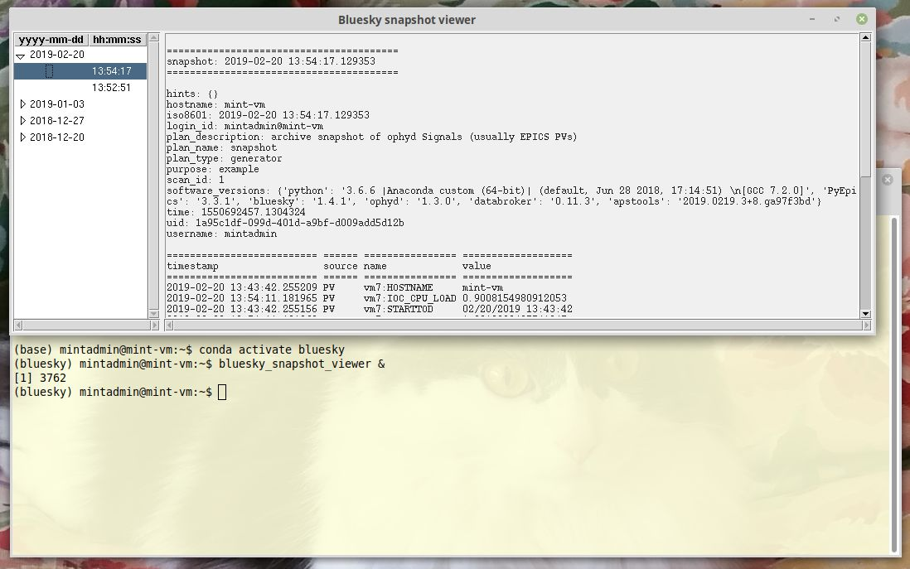

.. index:: bluesky_snapshot

.. _bluesky_snapshot:

bluesky_snapshot
----------------

Take a snapshot of a list of EPICS PVs and record it in the databroker.
Retrieve (and display) that snapshot later using 
``apstools.callbacks.SnapshotReport`` or :ref:`bluesky_snapshot_viewer`.

Example - command line
++++++++++++++++++++++

Before using the command-line interface, find out what
the *bluesky_snapshot* expects::

	$ bluesky_snapshot -h
   usage: bluesky_snapshot [-h] [-b BROKER_CONFIG] [-m METADATA_SPEC] [-r] [-v]
                           EPICS_PV [EPICS_PV ...]
   
   record a snapshot of some PVs using Bluesky, ophyd, and databroker
   version=0.0.40+26.g323cd35
   
   positional arguments:
     EPICS_PV              EPICS PV name
   
   optional arguments:
     -h, --help            show this help message and exit
     -b BROKER_CONFIG      YAML configuration for databroker, default:
                           mongodb_config
     -m METADATA_SPEC, --metadata METADATA_SPEC
                           additional metadata, enclose in quotes, such as -m
                           "purpose=just tuned, situation=routine"
     -r, --report          suppress snapshot report
     -v, --version         show program's version number and exit

The help does not tell you that the default for BROKER_CONFIG is 
"mongodb_config", a YAML file in one of the default locations where 
the databroker expects to find it.  That's what we have.

We want to snapshot just a couple PVs to show basic use.  
Here are their current values::

	$ caget prj:IOC_CPU_LOAD prj:SYS_CPU_LOAD
   prj:IOC_CPU_LOAD               0.900851
   prj:SYS_CPU_LOAD               4.50426

Here's the snapshot (we'll also set a metadata that says this is an example)::

	$ bluesky_snapshot prj:IOC_CPU_LOAD prj:SYS_CPU_LOAD -m "purpose=example"

   ========================================
   snapshot: 2019-01-03 17:02:42.922197
   ========================================
   
   hints: {}
   hostname: mint-vm
   iso8601: 2019-01-03 17:02:42.922197
   login_id: mintadmin@mint-vm
   plan_description: archive snapshot of ophyd Signals (usually EPICS PVs)
   plan_name: snapshot
   plan_type: generator
   purpose: example
   scan_id: 1
   software_versions: {'python': '3.6.6 |Anaconda custom (64-bit)| (default, Jun 28 2018, 17:14:51) \n[GCC 7.2.0]', 'PyEpics': '3.3.1', 'bluesky': '1.4.1', 'ophyd': '1.3.0', 'databroker': '0.11.3', 'apstools': '0.0.40+26.g323cd35.dirty'}
   time: 1546556562.9231327
   uid: 98a86a91-d41e-4965-a048-afa5b982a17c
   username: mintadmin
   
   ========================== ====== ================ ==================
   timestamp                  source name             value             
   ========================== ====== ================ ==================
   2019-01-03 17:02:33.930067 PV     prj:IOC_CPU_LOAD 0.8007421685989062
   2019-01-03 17:02:33.930069 PV     prj:SYS_CPU_LOAD 10.309472772459404
   ========================== ====== ================ ==================
   
   exit_status: success
   num_events: {'primary': 1}
   run_start: 98a86a91-d41e-4965-a048-afa5b982a17c
   time: 1546556563.1087885
   uid: 026fa69c-45b7-4b45-a3b3-266aadbf7176

We have a second IOC (*gov*) that has the same PVs.  Let's get them, too.::

	$ bluesky_snapshot {gov,otz}:{IOC,SYS}_CPU_LOAD -m "purpose=this is an example, example=example 2"

	========================================
	snapshot: 2018-12-20 18:21:53.371995
	========================================
	
	example: example 2
	hints: {}
	iso8601: 2018-12-20 18:21:53.371995
	plan_description: archive snapshot of ophyd Signals (usually EPICS PVs)
	plan_name: snapshot
	plan_type: generator
	purpose: this is an example
	scan_id: 1
	software_versions: {'python': '3.6.2 |Continuum Analytics, Inc.| (default, Jul 20 2017, 13:51:32) \n[GCC 4.4.7 20120313 (Red Hat 4.4.7-1)]', 'PyEpics': '3.3.1', 'bluesky': '1.4.1', 'ophyd': '1.3.0', 'databroker': '0.11.3', 'apstools': '0.0.37'}
	time: 1545351713.3727024
	uid: d5e15ba3-0393-4df3-8217-1b72d82b5cf9
	
	========================== ====== ================ ===================
	timestamp                  source name             value              
	========================== ====== ================ ===================
	2018-12-20 18:21:45.488033 PV     gov:IOC_CPU_LOAD 0.22522293126578166
	2018-12-20 18:21:45.488035 PV     gov:SYS_CPU_LOAD 10.335244804189122 
	2018-12-20 18:21:46.910976 PV     otz:IOC_CPU_LOAD 0.10009633509509736
	2018-12-20 18:21:46.910973 PV     otz:SYS_CPU_LOAD 11.360899731293234 
	========================== ====== ================ ===================
	
	exit_status: success
	num_events: {'primary': 1}
	run_start: d5e15ba3-0393-4df3-8217-1b72d82b5cf9
	time: 1545351713.3957422
	uid: e033cd99-dcac-4b56-848c-62eede1e4d77

You can log text and arrays, too.::

	$ bluesky_snapshot {gov,otz}:{iso8601,HOSTNAME,{IOC,SYS}_CPU_LOAD} compress \
	  -m "purpose=this is an example, example=example 2, look=can snapshot text and arrays too, note=no commas in metadata"

	========================================
	snapshot: 2018-12-20 18:28:28.825551
	========================================
	
	example: example 2
	hints: {}
	iso8601: 2018-12-20 18:28:28.825551
	look: can snapshot text and arrays too
	note: no commas in metadata
	plan_description: archive snapshot of ophyd Signals (usually EPICS PVs)
	plan_name: snapshot
	plan_type: generator
	purpose: this is an example
	scan_id: 1
	software_versions: {'python': '3.6.2 |Continuum Analytics, Inc.| (default, Jul 20 2017, 13:51:32) \n[GCC 4.4.7 20120313 (Red Hat 4.4.7-1)]', 'PyEpics': '3.3.1', 'bluesky': '1.4.1', 'ophyd': '1.3.0', 'databroker': '0.11.3', 'apstools': '0.0.37'}
	time: 1545352108.8262713
	uid: 7e77708e-9169-45ab-b2b6-4e31534d980a
	
	========================== ====== ================ ===================
	timestamp                  source name             value              
	========================== ====== ================ ===================
	2018-12-20 18:24:34.220028 PV     compress         [0.1, 0.2, 0.3]    
	2018-12-13 14:49:53.121188 PV     gov:HOSTNAME     otz.aps.anl.gov    
	2018-12-20 18:28:25.093941 PV     gov:IOC_CPU_LOAD 0.1501490058473918 
	2018-12-20 18:28:25.093943 PV     gov:SYS_CPU_LOAD 10.360270546421546 
	2018-12-20 18:28:28.817630 PV     gov:iso8601      2018-12-20T18:28:28
	2018-12-13 14:49:53.135016 PV     otz:HOSTNAME     otz.aps.anl.gov    
	2018-12-20 18:28:26.525208 PV     otz:IOC_CPU_LOAD 0.10009727705620367
	2018-12-20 18:28:26.525190 PV     otz:SYS_CPU_LOAD 12.937574161543873 
	2018-12-20 18:28:28.830285 PV     otz:iso8601      2018-12-20T18:28:28
	========================== ====== ================ ===================
	
	exit_status: success
	num_events: {'primary': 1}
	run_start: 7e77708e-9169-45ab-b2b6-4e31534d980a
	time: 1545352108.8656788
	uid: 0de0ec62-504e-4dbc-ad08-2507d4ed44f9

.. index:: bluesky_snapshot_viewer

.. _bluesky_snapshot_viewer:

bluesky_snapshot_viewer
-----------------------

View a snapshot previously recorded by the *databroker*.
This is a GUI program started with the command: `bluesky_snapshot_viewer`

Internally, this tool calls :class:`apstools.callbacks.SnapshotReport` to 
make the report.  There are no command line options or command line help.

   
   Screen shot of `bluesky_snapshot_viewer` GUI.

.. note:  The `bluesky_snapshot_viewer` requires the existence of a
   databroker configuration file named `mongodb_config.yml` in one 
   of the expected directories [#]_.

   .. [#] databroker search path for configuration files:
      http://nsls-ii.github.io/databroker/configuration.html#search-path

Source code documentation
+++++++++++++++++++++++++

.. automodule:: apstools.snapshot
    :members: 
